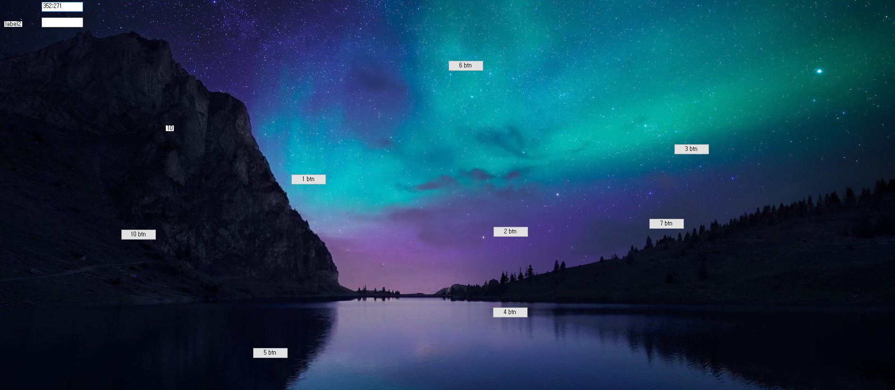

# 바탕화면 부수기

## 마일스톤

### 7.1 
  
마우스 위치를 가져옴

### 7.3
  
전체화면 캡처

  
클릭시 그 위치에 버튼 생성

    
미니건 추가  (쓰레드 이용)

### 7.6  
아이템코드 리펙토링
숫자키로 아이템 변경 
(스템프, 미니건)  

### 7.8
사다리 추가

   

### 7.15  
유저관리를 할 수 있는 GameManagement 솔루션 추가  

   
